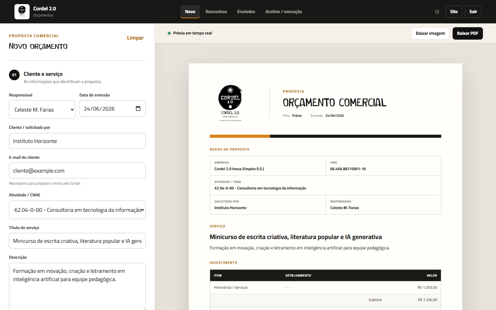

# Cordel 2.0 — Gerador de Orçamentos

Aplicação web leve para criar, salvar e acompanhar orçamentos comerciais da Cordel 2.0 Inova Simples (I.S.).

O frontend é estático e pode ser publicado no GitHub Pages. O backend usa Google Apps Script, Google Sheets e Google Drive.

## Prévia



## O que o sistema faz

- gera orçamento em visual único, preparado para impressão;
- calcula automaticamente subtotal, ISS de 5% e valor total;
- aceita vários itens de custo;
- oferece todos os CNAEs cadastrados e a opção “Outro CNAE”;
- possui configurações discretas para alterar o ISS padrão e editar CNAEs;
- reaproveita descrições anteriores organizadas pelo CNAE;
- usa fólio sequencial a partir de `00010`;
- salva rascunhos e permite retomá-los;
- mantém cada rascunho somente como JSON em uma pasta do Drive, sem PDF e sem consumir fólio;
- registra enviados, aceitos para execução, pagamento e data;
- exige confirmação de envio por `contato@cordel2pontozero.com`;
- gera PDF e imagem PNG;
- gera o PDF definitivo somente depois de reservar o fólio;
- cria um único PDF na pasta Enviados e move esse mesmo arquivo para Execução sem mudar o `pdfFileId`;
- mantém a imagem da equipe proporcional e somente no fechamento da página final;
- mantém o envio de e-mail ao cliente temporariamente indisponível;
- alerta a equipe após 5 dias úteis sem retorno do cliente;
- notifica coordenação e produção, sem anexo, ao finalizar o envio e ao iniciar a execução;
- permite cancelar com confirmação exata do fólio, restaurar pela Lixeira e excluir arquivos preservando o histórico da planilha;
- normaliza fólios antigos como `10` para `00010` e repara estados anteriores de execução;
- sinaliza visualmente quando o orçamento está em execução;
- evita gravações duplicadas com bloqueio no frontend e idempotência no backend;
- reduz recarregamentos com cache no navegador e no Apps Script;
- mostra o último histórico disponível enquanto atualiza os dados em segundo plano;
- mantém a assinatura da equipe fixa no documento;
- usa a fonte Cordelina nos títulos como elemento da identidade visual;
- protege os dados do backend com senha validada no Apps Script.
- troca a senha por uma sessão temporária após o login, sem armazená-la no navegador;
- reserva uma camada desativada para futuras integrações fiscais e bancárias.

## Estrutura real

```text
Recurso-Web/
├── index.html          Interface do gerador
├── style.css           Visual responsivo e impressão
├── app.js              Formulário, cálculos, PDF, imagem e integração
├── config.js           URL pública do Web App
├── integrations.js     Contrato público, sem segredos, para integrações futuras
├── Code.gs             Backend local do Google Apps Script (ignorado pelo Git)
├── README.md
├── docs/
│   └── SETUP.md        Publicação passo a passo
└── assets/
    ├── assinatura-equipe.jpg
    ├── LOGOMARCA-CORDEL 2.0 Inova Simples.png
    ├── Capa-LinkedIn.png
    ├── Template.docx
    ├── Fontes/
    └── vendor/
        └── html2pdf.bundle.min.js
```

## Antes de publicar

1. Siga [docs/SETUP.md](docs/SETUP.md).
2. Implante o `Code.gs` como Web App.
3. Cole a URL terminada em `/exec` no arquivo `config.js`.
4. Teste o fluxo completo antes de ativar o GitHub Pages.

O teste de aceitação deve confirmar que o `pdfFileId` retornado em Enviados é
exatamente o mesmo depois da passagem para Aceitos / execução. As funções
`diagnosticarConcorrenciaEIdempotencia` e `diagnosticarIntegridadePdf` ajudam
a conferir o resultado diretamente no Apps Script.

> A senha não deve ser escrita em `app.js`, `config.js`, `README.md` ou em qualquer arquivo público. Ela fica em uma Propriedade do script no Google Apps Script.

## Licença

Este é um software proprietário, com todos os direitos reservados à Cordel 2.0
Inova Simples (I.S.). O uso por terceiros depende de autorização comercial
escrita e pagamento acordado. Consulte [LICENSE.md](LICENSE.md) e
[THIRD_PARTY_NOTICES.md](THIRD_PARTY_NOTICES.md).

O `Code.gs` está no `.gitignore` e deve ser mantido diretamente no projeto
privado do Google Apps Script.

O endereço do Web App pode ser descoberto, mas listar ou alterar dados exige
uma sessão temporária válida. O frontend nunca contém a senha nem credenciais
de integrações.

## Tecnologias

- HTML, CSS e JavaScript sem framework;
- html2pdf.js 0.10.1, incluído localmente para geração do PDF;
- Google Apps Script para a API;
- Google Sheets para registros;
- Google Drive para PDFs, rascunhos e arquivos de execução;
- serviço de e-mail do Google para notificações internas;
- arquivos JSON no Google Drive para cópia e retomada dos rascunhos;
- GitHub Pages para hospedagem do frontend.

## Estado do projeto

O frontend funciona em **modo local** enquanto a URL do Apps Script não está configurada. Nesse modo, os registros ficam apenas no armazenamento do navegador e servem para revisão visual. Após configurar `config.js`, a entrada passa a validar a senha no backend e os registros são enviados ao Google.

Configurações feitas no modo local ficam somente naquele navegador. No modo
online, ISS e CNAEs são guardados nas Propriedades do script e compartilhados
pela equipe.
